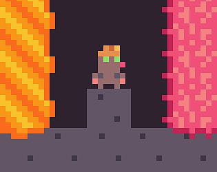

# __Jetpack Mole__

Jetpack Mole is a mobile arcade-style video game first created from the Brackeys game jam 2023 with Unity, later ported to Android. 

The retro-style experience is oriented around descending a randomly-generated endlessly scrolling world, mining varied ores and purchasing items at shops. A wall of fire accelerates behind the player to pose a greater challenge. The goal of the game is to beat your previous high score.
The game uses a multi-layered dynamically generated tilemap system to manage the overlapping borders of different ores. A simple world generation algorithm is used to keep the gameplay varied.

Music created by Trevor Lentz. Pixel art is custom-made in Adobe Photoshop.

This project is still work in progress with more planned features.
